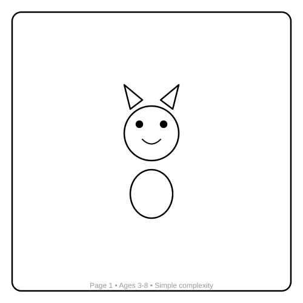
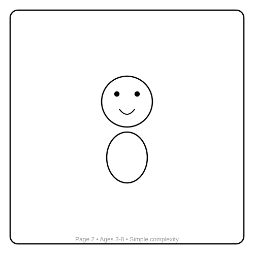
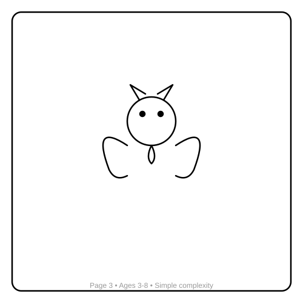
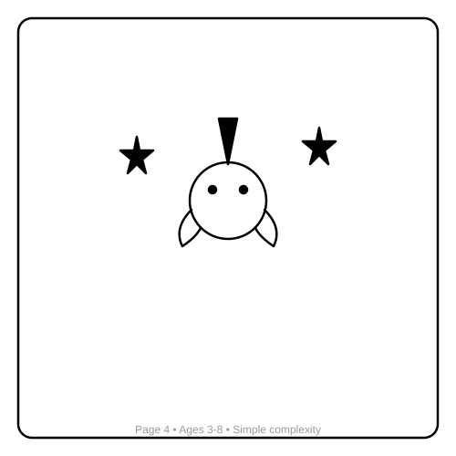
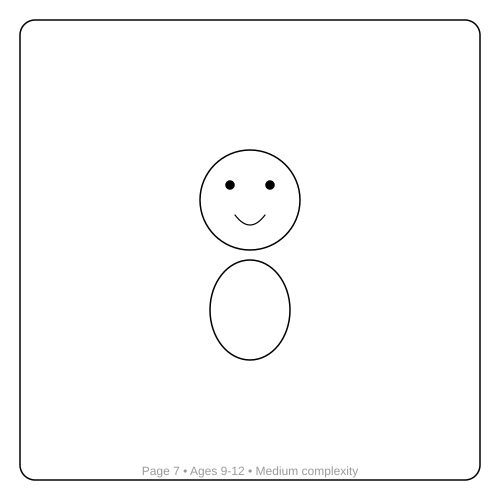
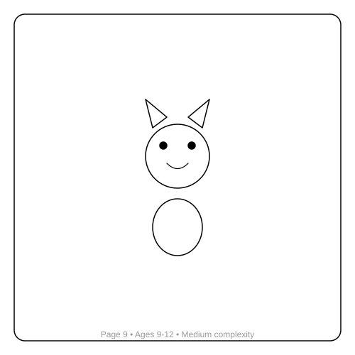
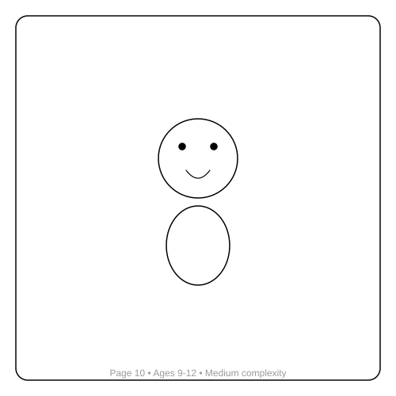
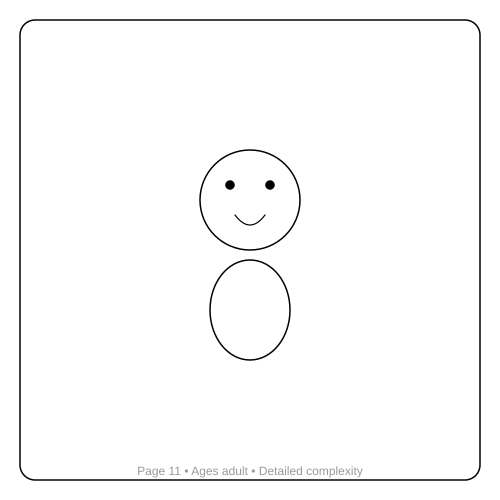
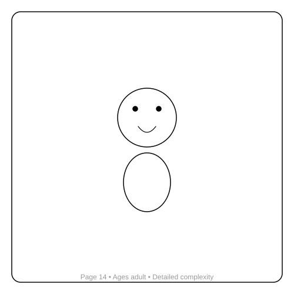

# DMAI's Magical Coloring Adventure
*By Alex Riviera*

## About This Book

This coloring book features **16 unique pages** - each with a different subject and complexity level.

**Age-appropriate designs:**
- Pages 1-5: For ages 3-8 (large spaces, simple shapes)
- Pages 6-10: For ages 9-12 (medium complexity)
- Pages 11-16: For teens/adults (detailed designs)

**Technical Specifications:**
- Line weight: 1.5-2.5pt for durability
- Rounded corners to prevent damage
- Single-sided pages to prevent bleed-through
- 0.25" minimum spacing between elements

---

## Page 1: A Cute Cat Wearing A Bow Tie

**Ages:** 3-8
**Complexity:** simple

---

## Page 2: A Smiling Dog With Floppy Ears

**Ages:** 3-8
**Complexity:** simple

---

## Page 3: A Friendly Dragon Breathing Sparkles

**Ages:** 3-8
**Complexity:** simple

---

## Page 4: A Magical Unicorn With A Starry Mane

**Ages:** 3-8
**Complexity:** simple

---

## Page 5: A Playful Dolphin Jumping Over Waves

**Ages:** 3-8
**Complexity:** simple

---

## Page 6: A Wise Owl Sitting On A Branch

**Ages:** 9-12
**Complexity:** medium

---

## Page 7: A Gentle Elephant With Big Floppy Ears

**Ages:** 9-12
**Complexity:** medium

---

## Page 8: A Curious Fox Exploring The Forest

**Ages:** 9-12
**Complexity:** medium

---

## Page 9: A Happy Bear Catching Fish

**Ages:** 9-12
**Complexity:** medium

---

## Page 10: A Colorful Butterfly In A Garden

**Ages:** 9-12
**Complexity:** medium

---

## Page 11: A Princess In A Tall Tower

**Ages:** adult
**Complexity:** detailed

---

## Page 12: A Knight With A Shiny Shield

**Ages:** adult
**Complexity:** detailed

---

## Page 13: A Rocket Ship Flying To The Moon

**Ages:** adult
**Complexity:** detailed

---

## Page 14: A Pirate Ship On The Ocean

**Ages:** adult
**Complexity:** detailed

---

## Page 15: A Fairy With Sparkling Wings

**Ages:** adult
**Complexity:** detailed

---

## Page 16: A Dinosaur In A Prehistoric Jungle

**Ages:** adult
**Complexity:** detailed

---

## About the Creator

Alex Riviera created this coloring book using knowledge learned from professional coloring book design guides. Each page is unique and designed for its target age group.

---

*Created with attention to technical specifications and age-appropriate design*
